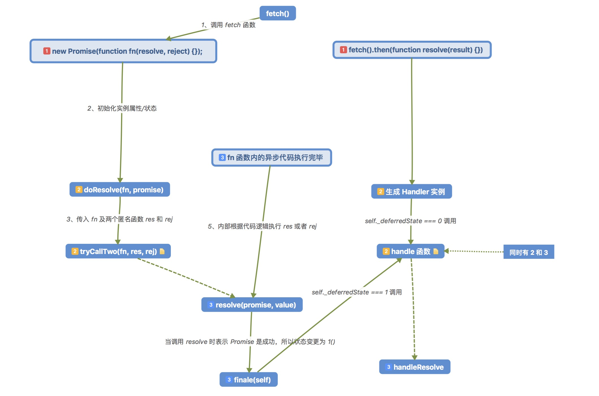

# Promise 源码阅读

本质上还是回调，不过可以链式调用很厉害。

## 原理大概

就像上面说的，本质上还是回调：

```javascript

function fetch() {
    return new Promise(function fn(resolve, reject) {
        setTimeout(() => {
            resolve('hello');
        }, 3000);
    });
}

fetch();
```

很明显，在调用`fetch`的时候，就会实例化一个`promise`对象，然后内部一系列处理，主要是调用了`fn`这个函数。既然调用了`fn`这个函数，那就会有一个异步操作（这里是`setTimeout`）在执行。

异步操作结束，调用`resolve`函数，而这个函数，会去拿自身实例的`then`方法的参数，上面的代码是没有调用`then`方法的，自然就没有，所以上面的代码会报错，没有处理成功或者失败。

```javascript
fetch()
    .then(res => {
        console.log(res);
    })
    .catch(err => {
        console.log(err);
    });
```

首先要明确的是，代码的执行是很快的，调用`fetch`函数并调用`then`方法可以说都是在一瞬间就完成了，只剩下异步代码在调用。所以上面的代码，会一直等待异步代码的执行完毕。


如果异步代码执行完成并`resolve`了，在`Promise`源码内部调用了`resolve`函数，并且拿到了`hello`这个值，最终调用`then`的参数，传入`hello`。

### 流程图




## 链式调用

`Promise`的精华就在于链式调用更加直观，所以如何实现链式调用呢，重点在于`then`方法的参数返回值。

就像之前说的，`then`方法的调用是一瞬间的，下面代码：

```javascript
fetch()
    .then(res => {
        console.log(res);
        return fetch();
    })
    .then(res => {
        console.log(res);
    });
```
第二个`then`方法的调用会报错，将上面代码拆开来看，应该是这样的：

```javascript
const promise1 = fetch();
const promise2 = promise1.then(res => {
    console.log(res);
    return fetch();
});
promise2.then(res => {
    console.log(res);
});
```

所以重点在于`then`方法应该要返回东西？

源码中是返回了一个空`Promise`实例：

```javascript
Promise.prototype.then = function(onFulfilled, onRejected) {
    if (this.constructor !== Promise) {
        return safeThen(this, onFulfilled, onRejected);
    }
    var res = new Promise(noop);
    handle(this, new Handler(onFulfilled, onRejected, res));
    return res;
};
```
**空`Promise`实例**表示有`_state`和`then`方法，没有传参数的这种，啊，好难描述。总之就是一个`promise`实例。

这样做就解决了第一个问题，即**第二个`then`方法会报错**。

再来解决怎么触发第二个`then`，源码是采用了`resolve`与`reject`方法都接收一个`promise`作为参数。

在`handleResolve`最后增加`resolve`调用，传入上面提到的那个空`Promise`对象，最重要的是，再传入调用`then`的参数后得到的结果，其实就是这样：

```javascript
const ret = tryCallOne(cb, self._value);
resolve(self.promise, ret); // ret === fetch()
```

但是，现在的`resolve`函数仅仅是调用，没有处理上面这种情况，所以就要增加代码了。

## catch 语法糖

规范的`Promise`成功与失败的处理函数都是放在`then`方法内的：

```javascript
fetch()
    .then(res => {
        console.log(res);
    }, err => {
        console.error(err);
    });
```

不过可以使用`catch`让代码更加清晰：

```javascript
fetch()
    .then(res => {
        console.log(res);
    })
    .catch(err => {
        console.error(err);
    });
```


