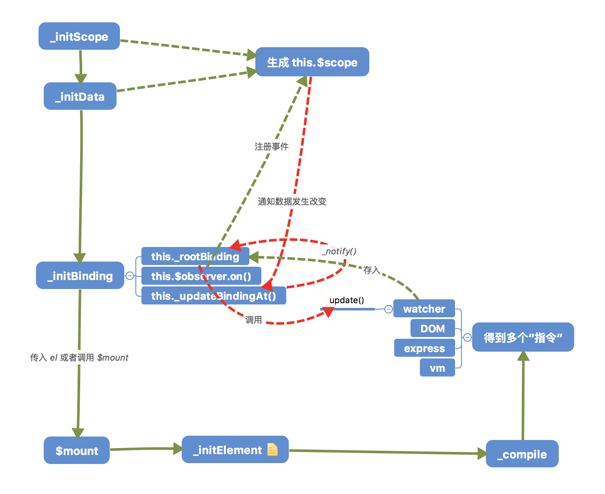

# 0.11.0 版 vue 源码

此次的版本为：[b1654d5e024b523650c60df8f4c8e89f59d47b63](https://github.com/vuejs/vue/tree/b1654d5e024b523650c60df8f4c8e89f59d47b63)

和`02`文件夹内的代码是同一版本，这次的目的是实现双向绑定，即改变`data`上的值，页面上同步发生改变。

## 分析

### 流程图

以一个简单的流程图来说明：



### instance/binding.js

很重要的一个文件，里面定义的同样是`Vue`的私有方法，`_initBinding()`初始化了一棵**绑定树**，

```javascript
this._rootBinding = new Binding()
```

从这里就可以看出，`vue`实例上，会有一个`_rootBinding`属性，该属性的值是一个`Binding`实例。

并且在`_initBinding()`内，给`this.$observer`注册了`set`、`get`等事件，而我们又知道，任何一个数据变化，最终都会冒泡到根节点上，所以一旦数据发生了改变，就会调用在这里传入的回调函数，重点先关注`_updateBindingAt`方法。

#### _updateBindingAt

```javascript
function _updateBindingAt(path) {
    // root binding updates on any change
    this._rootBinding._notify()
    // var binding = this._getBindingAt(path, true)
    // if (binding) {
    //     binding._notify()
    // }
}
```

现在知道了，当数据发生改变，就会调用该函数，而在该函数内，先是调用了`this._rootBinding._notify()`，而`_rootBinding`是`Binding`实例，所以就知道`_notify()`方法是在`bindings.js`文件内。

### bindings.js

粗略一看，就能了解，一个`Binding`实例，仅仅是维护着一个指令列表`this._subs`，使用`_notify`方法拿出每一个指令并调用指令的`update()`方法。所以就到了`directive.js`文件中。


### directive.js

指令类原型方法来自该文件与`directives/index.js`两个文件，后者定义了`bind()`与`update()`两个核心方法。

```javascript
function Directive(name, el, vm, descriptor) {
    //...
}
```

指令内保存着该指令绑定的`DOM`元素，和`vm`实例，从`vm`实例上拿到`data`渲染到`el`上，指令的作用大概就是这样的。在指令内会创建`Watcher`实例，当数据发生改变，会先调用`Watcher`实例的`update()`方法，再经由`batcher`这个任务队列管理器？

最后才真正会调用指令的`update()`方法实现更新页面数据。


