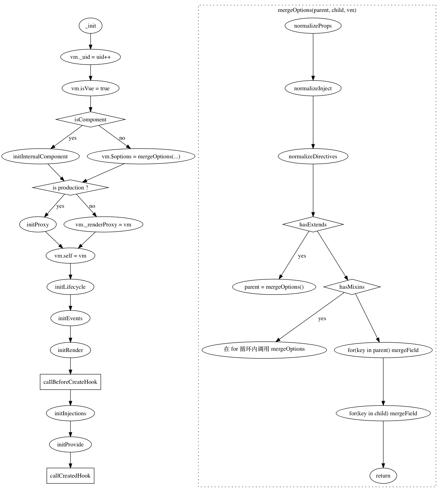
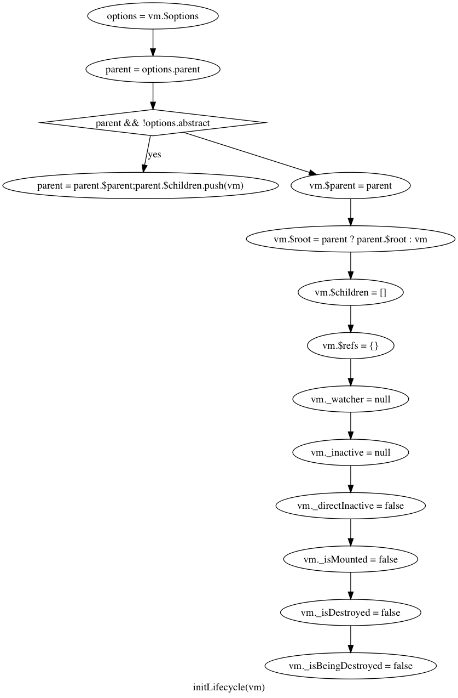

# vue 源码阅读过程

## _init

调用`this._init`发生了什么？

主要来说，就是给`vm`添加了

- _uid
- _isVue = true
- $options = options
- _self = this

以及调用了`beforeCreated`钩子和`created`钩子。

### initLifecycle

在`_init`函数内调用了`initLifecycle`函数，从名字看是初始化生命周期？实际上就是给`vm`添加了很多的属性：

- $parent = options.parent
- $root = $parent.root || vm
- $children = []
- $refs = {}
- _watcher = null
- _inactive = null
- _directInactive = false
- _isMounted = false = false
- _isDestroyed = false
- _isBeingDestroyed = false

### initEvent

顾名思义，初始化事件，主要就是将`_parentListeners`上的事件，注册到`vm`上？并将旧事件（如果有）就更新或者移除掉。

由于是使用`vm.$on`或者`vm.$once`添加事件，不过有个疑问就是为什么`vm`有这些方法，是在哪里添加的？

